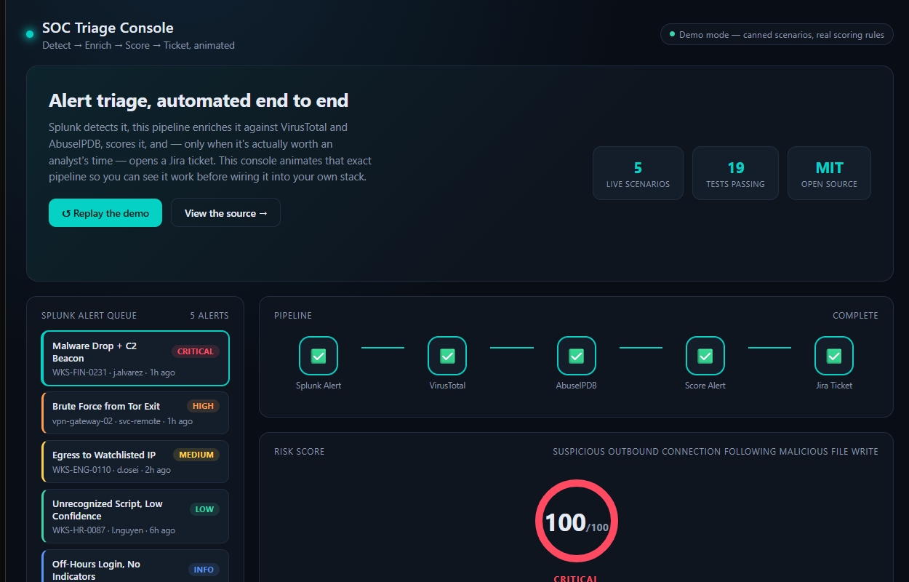
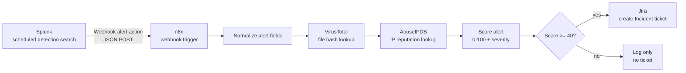

# SOC Incident Response & Threat Enrichment Pipeline 🛡️

[](https://github.com/Mangesh-Bhattacharya/soc-incident-response-pipeline/actions/workflows/ci.yml)


**Detect → Enrich → Score → Ticket.** A SOC analyst's first ten minutes on
every alert look the same: copy the file hash into VirusTotal, copy the
source IP into AbuseIPDB, decide if it's worth escalating, then type up a
Jira ticket if it is. This pipeline does that first pass automatically —
Splunk detects, VirusTotal and AbuseIPDB enrich, a transparent scoring rubric
decides severity, and only alerts that clear the bar get a ticket, evidence
already attached.



*The included [dashboard](#animated-dashboard) animating a real alert through
the pipeline — a CRITICAL malware + C2 detection, VirusTotal and AbuseIPDB
enrichment, and the resulting Jira ticket, end to end.*

## Try it in one command

```bash
git clone https://github.com/Mangesh-Bhattacharya/soc-incident-response-pipeline.git
cd soc-incident-response-pipeline
cp .env.example .env      # fill in VT_API_KEY / ABUSEIPDB_API_KEY / JIRA_* — or leave blank for demo mode
docker compose up --build
```

Open **http://localhost:8080**. No Python or Node.js install on the host —
the dashboard and API run in containers behind an nginx reverse proxy, bound
to `127.0.0.1` by default so it needs no firewall exception on Linux, macOS,
or Windows. See [`docs/docker.md`](docs/docker.md) for the security
rationale and how to open it up to your LAN if you want that.

Prefer to run it without Docker? See [Other ways to run this](#other-ways-to-run-this).

## Why this exists

That first-pass triage work isn't hard, it's just repetitive and constant —
exactly the kind of task that doesn't scale by hand past a handful of alerts
a day, and exactly the kind automation is good at. Automating it doesn't
replace an analyst's judgment; it clears the mechanical part away so the
judgment call is the only thing left for a human to make.

## How it works



| Layer | Tool | Role |
|---|---|---|
| **Detect** | Splunk | Scheduled SPL searches flag suspicious activity (brute-force auth, malware file writes, C2 beaconing, watchlisted IPs) and fire a webhook alert action. |
| **Orchestrate** | n8n *or* Python | Receives the alert, calls both enrichment APIs, scores it, and branches to ticket-creation or log-only. Two interchangeable implementations — see below. |
| **Enrich (files)** | VirusTotal | Reputation lookup for file hashes — how many AV engines flag it malicious. |
| **Enrich (network)** | AbuseIPDB | Reputation lookup for source IPs — abuse confidence score, Tor exit node status. |
| **Ticket** | Jira | Auto-creates a prioritized `Incident` issue, with the enrichment evidence already in the description, for anything that crosses the scoring threshold. |

Full diagram and design notes: [`docs/architecture.md`](docs/architecture.md).

## What's inside

This repo ships **three interchangeable ways to run the same logic**, plus a
dashboard that visualizes any of them:

- **[`src/socpipeline/`](src/socpipeline/)** — a plain Python package (the
  code path): VirusTotal/AbuseIPDB clients, the scoring engine, Jira ticket
  creation, and orchestration. Runnable via [`cli.py`](cli.py) or importable
  into your own service.
- **[`n8n/soc_triage_workflow.json`](n8n/soc_triage_workflow.json)** — the
  identical logic as an importable, no-code n8n workflow, for a SOC that
  already runs n8n.
- **[`api/`](api/main.py)** — a small FastAPI wrapper around the Python
  package, used by the dashboard and the Docker deployment.
- **[`docker-compose.yml`](docker-compose.yml)** — the one-command
  deployment above: dashboard + API, hardened and reverse-proxied.

### Animated dashboard

**[`dashboard/`](dashboard/)** is a React + TypeScript console (a
deliberately different stack from the Python backend) that visualizes the
pipeline running. Click a queued alert — or just wait a couple of seconds,
it plays one automatically — and watch it move stage by stage: pipeline
nodes lighting up, a risk gauge counting up, enrichment cards animating in,
and a Jira ticket (or "logged only") outcome at the end.

It needs no backend to run: five scenarios spanning CRITICAL → INFO are
precomputed with the *exact same scoring rubric* as [`scoring.py`](src/socpipeline/scoring.py),
so nothing shown is invented. Point it at the FastAPI backend (which the
Docker setup does automatically, same-origin, zero config) and it animates
the real pipeline's output instead — always in dry-run mode, so the console
itself can never file an actual Jira ticket.

## Scoring model

Transparent and tunable rather than a black box — see
[`scoring.py`](src/socpipeline/scoring.py):

- VirusTotal: +6 points per engine flagging **malicious** (capped at 60), +2
  per **suspicious** (capped at 10).
- AbuseIPDB: its 0–100 abuse-confidence score, weighted 50%; +10 flat if the
  IP is a known Tor exit node.
- Combined score (capped at 100) maps to a severity:

  | Score | Severity | Jira priority | Ticket created? |
  |---|---|---|---|
  | 80–100 | CRITICAL | Highest | ✅ |
  | 60–79 | HIGH | High | ✅ |
  | 40–59 | MEDIUM | Medium | ✅ |
  | 1–39 | LOW | Low | ❌ (logged only) |
  | 0 | INFO | Lowest | ❌ (logged only) |

Field-level mapping into the actual Jira ticket:
[`jira/ticket_template.md`](jira/ticket_template.md).

## Other ways to run this

<details>
<summary><strong>Python pipeline, no Docker</strong></summary>

```bash
pip install -r requirements-dev.txt
cp .env.example .env   # fill in VT_API_KEY, ABUSEIPDB_API_KEY, JIRA_* — or leave blank for --dry-run

python cli.py --alert examples/sample_splunk_alert.json --dry-run
```

The bundled sample alert uses the [EICAR test file hash](https://en.wikipedia.org/wiki/EICAR_test_file)
(universally flagged malicious by every AV engine on VirusTotal, but
harmless) and a known Tor exit-node IP range, so a real run against live
VirusTotal/AbuseIPDB keys reliably scores `CRITICAL` and shows the full
ticket-creation path without needing an actual malware sample.

Run the test suite (fully mocked — no API keys or network access required):

```bash
pytest tests/ -v
```
</details>

<details>
<summary><strong>n8n workflow</strong></summary>

1. Import [`n8n/soc_triage_workflow.json`](n8n/soc_triage_workflow.json) into n8n.
2. Wire up the VirusTotal / AbuseIPDB / Jira credentials.
3. Point a Splunk alert's Webhook action at the workflow's production URL.

Full steps: [`n8n/README.md`](n8n/README.md) and
[`splunk/alert_webhook_setup.md`](splunk/alert_webhook_setup.md).
</details>

<details>
<summary><strong>Dashboard only, without Docker</strong></summary>

```bash
cd dashboard
npm install
npm run dev
```

Opens at `http://localhost:5173` in demo mode. See
[`dashboard/README.md`](dashboard/README.md) for live mode (pointing it at a
locally-run `api/`) and a note on `npm install` inside cloud-synced folders.
</details>

## Repository structure

```
docker-compose.yml   One-command Docker deployment (dashboard + API, reverse-proxied)
splunk/              SPL detection searches + Splunk webhook alert action setup
n8n/                 Importable n8n workflow (the no-code path)
src/socpipeline/     Python package (the code path): VT + AbuseIPDB clients,
                     scoring, Jira ticket creation, pipeline orchestration
api/                 FastAPI wrapper around socpipeline (used by the dashboard/Docker setup)
dashboard/           React + TypeScript animated console, and its own Dockerfile
jira/                Ticket field mapping / template reference
examples/            Sample Splunk alert payload used by the CLI, tests, and docs
tests/               Pytest suite — every external API call is mocked
docs/                Architecture diagram, design notes, and the Docker security writeup
cli.py               Run the Python pipeline against an alert JSON file
```

## Security notes

- API keys live in environment variables (`.env`, gitignored) or n8n
  credentials — never hardcoded, never committed. `.env.example` documents
  every variable the pipeline reads, and `.dockerignore` keeps `.env` out of
  the Docker build context as a second line of defense.
- The Docker deployment runs both containers as non-root with read-only root
  filesystems, all Linux capabilities dropped, and the API container
  unreachable from outside the compose network — see
  [`docs/docker.md`](docs/docker.md) for the full rationale, including why
  the default setup needs no firewall exception on Linux, macOS, or Windows.
- The n8n webhook accepts unauthenticated POSTs by default — see the "Restrict
  who can reach the webhook" section in
  [`splunk/alert_webhook_setup.md`](splunk/alert_webhook_setup.md) before
  exposing it beyond a lab environment.
- The sample alert's file hash is the well-known EICAR test signature, not
  live malware — safe to commit and safe to submit to VirusTotal.

## License

[MIT](LICENSE)
