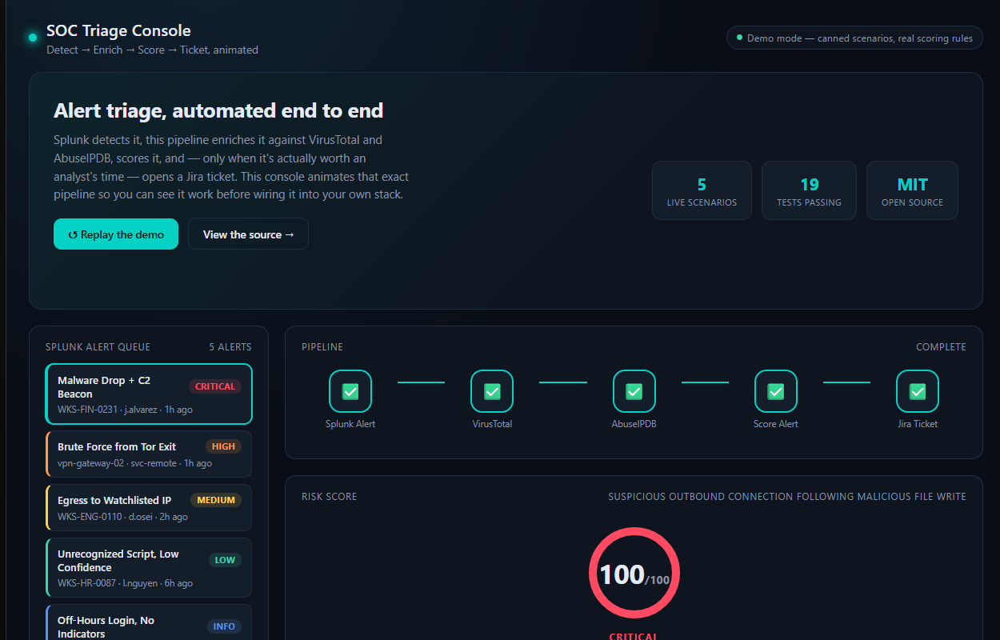
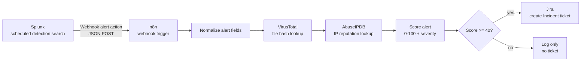
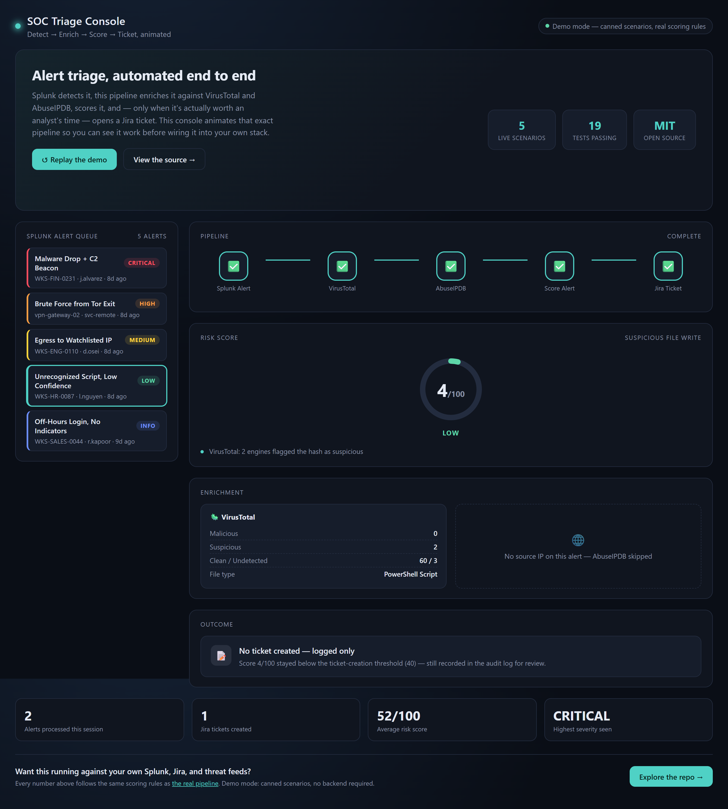

# SOC Incident Response and Threat Enrichment Pipeline 🛡️

[](https://github.com/Mangesh-Bhattacharya/soc-incident-response-pipeline/actions/workflows/ci.yml)


**Detect, enrich, score, ticket.** A SOC analyst's first ten minutes on every alert look the same: copy the file hash into VirusTotal, copy the source address into AbuseIPDB, decide whether it is worth escalating, then write a Jira ticket if it is. This pipeline does that first pass automatically. Splunk detects, VirusTotal and AbuseIPDB enrich, a transparent scoring rubric decides severity, and only alerts that clear the bar get a ticket with the evidence already attached.

Severity is assigned by arithmetic you can read in one file, not by a model. [That is a deliberate choice](#why-the-scoring-layer-is-deterministic), and the reasoning matters more than the code.



*The included [dashboard](#animated-dashboard) animating a real alert through the pipeline: a CRITICAL malware and C2 detection, VirusTotal and AbuseIPDB enrichment, and the resulting Jira ticket, end to end.*

## Try it in one command

```bash
git clone https://github.com/Mangesh-Bhattacharya/soc-incident-response-pipeline.git
cd soc-incident-response-pipeline
cp .env.example .env      # fill in VT_API_KEY / ABUSEIPDB_API_KEY / JIRA_*, or leave blank for demo mode
docker compose up --build
```

Open **http://localhost:8080**. No Python or Node.js install on the host. The dashboard and API run in containers behind an nginx reverse proxy, bound to `127.0.0.1` by default so it needs no firewall exception on Linux, macOS, or Windows. See [`docs/docker.md`](docs/docker.md) for the security rationale and how to expose it to your LAN if you want that.

Prefer to run it without Docker? See [Other ways to run this](#other-ways-to-run-this).

## Why this exists

That first pass triage work is not hard, it is repetitive and constant, which is exactly the kind of task that does not scale by hand past a handful of alerts a day and exactly the kind automation is good at. Automating it does not replace an analyst's judgment. It clears the mechanical part away so the judgment call is the only thing left for a human to make.

Decomposed, the first pass is five steps and only one of them needs a person. Extracting indicators is mechanical. Looking up hash reputation is mechanical. Looking up address reputation is mechanical. Writing the ticket with evidence at the right priority is mechanical. Deciding what it means is not. This automates the four.

## How it works


```mermaid
flowchart LR
    A[Splunk<br/>scheduled detection search] -->|Webhook alert action<br/>JSON POST| B[n8n<br/>webhook trigger]
    B --> C[Normalize alert fields]
    C --> D[VirusTotal<br/>file hash lookup]
    D --> E[AbuseIPDB<br/>IP reputation lookup]
    E --> F[Score alert<br/>0-100 + severity]
    F --> G{Score >= 40?}
    G -- yes --> H[Jira<br/>create Incident ticket]
    G -- no --> I[Log only<br/>no ticket]
```

| Layer | Tool | Role |
|---|---|---|
| **Detect** | Splunk | Scheduled SPL searches flag suspicious activity (brute force auth, malware file writes, C2 beaconing, watchlisted addresses) and fire a webhook alert action. |
| **Orchestrate** | n8n *or* Python | Receives the alert, calls both enrichment APIs, scores it, and branches to ticket creation or log only. Two interchangeable implementations, see below. |
| **Enrich (files)** | VirusTotal | Reputation lookup for file hashes, meaning how many engines flag it malicious. |
| **Enrich (network)** | AbuseIPDB | Reputation lookup for source addresses: abuse confidence score, Tor exit node status. |
| **Ticket** | Jira | Auto-creates a prioritized `Incident` issue, with the enrichment evidence already in the description, for anything that crosses the scoring threshold. |

Full diagram and design notes: [`docs/architecture.md`](docs/architecture.md).

## Scoring model

Transparent and tunable rather than a black box. See [`scoring.py`](src/socpipeline/scoring.py):

- VirusTotal: 6 points per engine flagging the hash **malicious** (capped at 60), 2 per **suspicious** (capped at 10).
- AbuseIPDB: its 0 to 100 abuse confidence score, weighted 50 percent, plus 10 flat if the address is a known Tor exit node.
- Combined score (capped at 100) maps to a severity:

  | Score | Severity | Jira priority | Ticket created? |
  |---|---|---|---|
  | 80 to 100 | CRITICAL | Highest | ✅ |
  | 60 to 79 | HIGH | High | ✅ |
  | 40 to 59 | MEDIUM | Medium | ✅ |
  | 1 to 39 | LOW | Low | ❌ (logged only) |
  | 0 | INFO | Lowest | ❌ (logged only) |

Field level mapping into the actual Jira ticket: [`jira/ticket_template.md`](jira/ticket_template.md).

### The suppression path is half the product



A pipeline that only escalates has increased analyst load rather than reduced it. The value is as much in the alerts that never generate a ticket as in the ones that do, and an analyst's confidence in what the pipeline drops is what decides whether it survives contact with a real queue. That is also why the [enrichment failure behaviour](#known-limitations) documented below matters more than any of the escalation logic.

## Why the scoring layer is deterministic

The obvious question in 2026 is why severity is assigned by roughly forty lines of arithmetic instead of a model. Three reasons, in increasing order of importance.

**Reproducibility.** The same alert has to produce the same severity today and at a post incident review eight months from now. Sampling behaviour, context ordering, and model version drift all work against that, and pinning a version only defers the problem.

**Auditability.** In a regulated environment somebody eventually asks why a given alert was classified the way it was. Six points per malicious engine verdict, capped at sixty, is an answer that survives an audit. A confidence score is a different kind of answer.

**Input provenance.** Alert payloads contain attacker controlled strings. File paths, process names, command lines, parent process arguments, and hostnames are all partly or wholly chosen by whoever generated the activity. Routing those fields into a model that decides escalation creates a prompt injection surface at the exact point where the system decides whether a human ever sees the event. An attacker who can name a file gets a vote on whether anyone looks at the file, and a successful attempt produces no alert to investigate.

None of this says models have no place in a SOC. Summarisation, correlation, and hunting hypotheses are all reasonable uses. The escalation gate is not. If you are building model driven triage, this repository is a reasonable baseline to measure against: keep the ingestion, enrichment, ticketing, and test harness, replace `scoring.py`, and you have a controlled comparison over identical inputs.

## Known limitations

Stated plainly, because finding these in week two is worse than reading them now. Each one is also a good contribution, see [Contributing](#contributing).

**Enrichment failure fails closed, with a coarse priority.** A lookup that errors (HTTP 429, timeout, missing API key) is distinct from one that returns "not found". `score_alert` records it in `enrichment_errors`, and any alert with a failed lookup gets a ticket regardless of score, at `Medium` unless surviving evidence already scores higher. The reason line names which source failed. A genuine 404 from VirusTotal (hash never seen) still counts as a clean negative:

```
Rate limited (HTTP 429)     score=  0  INFO  ticket=True   priority=Medium
Network timeout             score=  0  INFO  ticket=True   priority=Medium
API key missing             score=  0  INFO  ticket=True   priority=Medium
Genuinely unknown (404)     score=  0  INFO  ticket=False
Known clean, 70 harmless    score=  0  INFO  ticket=False
```

The residual risk is the inverse: with no caching or backoff (see below), a burst of correlated alerts can exhaust the VirusTotal free tier and turn every later alert into a ticket. That floods the queue instead of silently dropping evidence, which is the safer failure, but it is still a failure. Caching and backoff are the fix.

**The VirusTotal term saturates at ten engines.** `min(malicious * 6, 60)` reaches its cap at ten detections, so ten engines and seventy engines produce an identical 60 points. The bundled EICAR sample at 58 engines scores the same as a borderline packer false positive.

**Scoring uses absolute detection counts, not ratios.** Ten of twelve engines and ten of seventy engines are the same number to the rubric, even though `total_engines()` is computed and available on the result object.

**There is no behavioural axis.** Event count is discarded at normalisation, so forty failed logins and one failed login score identically. This is the real reason a brute force burst from a dirty Tor address lands at 54 (MEDIUM) rather than higher.

**There is no enrichment caching, backoff, or retry.** Every alert triggers a fresh API call.

**No containment actions.** Enrich, score, ticket. No host isolation, no account disable, no firewall changes, deliberately.

**Enrichment sends indicators off site.** VirusTotal and AbuseIPDB are external services, so hashes and addresses leave your environment. For most organisations that is an accepted trade. For air gapped or classified deployments it is disqualifying, which is why the clients sit behind a narrow interface that a MISP or internal threat intelligence platform client can replace.

**The n8n webhook accepts unauthenticated POSTs by default.** See the "Restrict who can reach the webhook" section in [`splunk/alert_webhook_setup.md`](splunk/alert_webhook_setup.md) before exposing it beyond a lab.

## Contributing

Issues and pull requests are welcome, and corrections are as welcome as features. Good places to start, roughly in order of value:

1. **A calibration harness.** A labelled corpus of alerts plus a runner that reports a confusion matrix for a given weight set. This turns every argument about whether a score is correct from opinion into measurement, and it is what would let a model based scorer be compared against this rubric fairly.
2. **Surfacing enrichment failure in the dashboard.** The API now returns `enrichment_failed` and `enrichment_errors`; the console does not render them yet.
3. **Ratio based VirusTotal scoring** using the denominator already on the result object, with a curve instead of a linear cap.
4. **A behavioural scoring axis** carrying event count through from the Splunk payload.
5. **Enrichment caching with backoff**, keyed on hash and address with a short time to live.
6. **An additional ticketing backend.** `jira_client.py` is small and isolated, so ServiceNow or TheHive would each be contained.
7. **Windows setup notes for the README.** `python -m venv` can produce an environment without a working pip, and `ensurepip` may fail to repair it, while installing against the system interpreter with `--user` works. Worth documenting.

If you run this against real alert volume, the single most useful thing you can send is an alert that scored LOW and should have been CRITICAL, with the enrichment values that produced it.

## What's inside

This repo ships **three interchangeable ways to run the same logic**, plus a dashboard that visualizes any of them:

- **[`src/socpipeline/`](src/socpipeline/)** is a plain Python package (the code path): VirusTotal and AbuseIPDB clients, the scoring engine, Jira ticket creation, and orchestration. Runnable via [`cli.py`](cli.py) or importable into your own service.
- **[`n8n/soc_triage_workflow.json`](n8n/soc_triage_workflow.json)** is the identical logic as an importable, no code n8n workflow, for a SOC that already runs n8n.
- **[`api/`](api/main.py)** is a small FastAPI wrapper around the Python package, used by the dashboard and the Docker deployment.
- **[`docker-compose.yml`](docker-compose.yml)** is the one command deployment above: dashboard plus API, hardened and reverse proxied.

### Animated dashboard

**[`dashboard/`](dashboard/)** is a React and TypeScript console (a deliberately different stack from the Python backend) that visualizes the pipeline running. Click a queued alert, or just wait a couple of seconds since it plays one automatically, and watch it move stage by stage: pipeline nodes lighting up, a risk gauge counting up, enrichment cards animating in, and a Jira ticket or a "logged only" outcome at the end.

It needs no backend to run. Five scenarios spanning CRITICAL to INFO are precomputed with the *exact same scoring rubric* as [`scoring.py`](src/socpipeline/scoring.py), so nothing shown is invented. Point it at the FastAPI backend, which the Docker setup does automatically, same origin, zero config, and it animates the real pipeline's output instead, always in dry run mode so the console itself can never file an actual Jira ticket.

## Other ways to run this

<details>
<summary><strong>Python pipeline, no Docker</strong></summary>

```bash
pip install -r requirements-dev.txt
cp .env.example .env   # fill in VT_API_KEY, ABUSEIPDB_API_KEY, JIRA_*, or leave blank for --dry-run

python cli.py --alert examples/sample_splunk_alert.json --dry-run
```

With no API keys configured this returns `0/100 (INFO)` with an "Enrichment incomplete" reason and a would-be `Medium` ticket, because a missing key is an enrichment failure, not a clean verdict. See [Known limitations](#known-limitations).

The bundled sample alert uses the [EICAR test file hash](https://en.wikipedia.org/wiki/EICAR_test_file), universally flagged malicious by every engine on VirusTotal but harmless, and a known Tor exit node address, so a real run against live keys reliably scores `CRITICAL` and shows the full ticket creation path without needing an actual malware sample.

Run the test suite (fully mocked, no API keys or network access required):

```bash
pytest tests/ -v
```

Expected: `23 passed` in well under a second.
</details>

<details>
<summary><strong>n8n workflow</strong></summary>

1. Import [`n8n/soc_triage_workflow.json`](n8n/soc_triage_workflow.json) into n8n.
2. Wire up the VirusTotal, AbuseIPDB, and Jira credentials.
3. Point a Splunk alert's Webhook action at the workflow's production URL.

Full steps: [`n8n/README.md`](n8n/README.md) and [`splunk/alert_webhook_setup.md`](splunk/alert_webhook_setup.md).
</details>

<details>
<summary><strong>Dashboard only, without Docker</strong></summary>

```bash
cd dashboard
npm install
npm run dev
```

Opens at `http://localhost:5173` in demo mode. See [`dashboard/README.md`](dashboard/README.md) for live mode (pointing it at a locally run `api/`) and a note on `npm install` inside cloud synced folders.
</details>

## Repository structure

```
docker-compose.yml   One-command Docker deployment (dashboard + API, reverse-proxied)
splunk/              SPL detection searches + Splunk webhook alert action setup
n8n/                 Importable n8n workflow (the no-code path)
src/socpipeline/     Python package (the code path): VT + AbuseIPDB clients,
                     scoring, Jira ticket creation, pipeline orchestration
api/                 FastAPI wrapper around socpipeline (used by the dashboard/Docker setup)
dashboard/           React + TypeScript animated console, and its own Dockerfile
jira/                Ticket field mapping / template reference
examples/            Sample Splunk alert payload used by the CLI, tests, and docs
tests/               Pytest suite, every external API call is mocked
docs/                Architecture diagram, design notes, and the Docker security writeup
cli.py               Run the Python pipeline against an alert JSON file
```

## Reliability and maintenance

No software is bug free, and I will not claim this is. The [Known limitations](#known-limitations) section above is the honest list. Here is what stands between a regression and `main`, and it runs without anyone having to remember to check:

- **Dependabot** watches every dependency (Python, npm, both Docker base images, and the GitHub Actions themselves) and opens a PR the moment a security patch or version bump lands.
- **CodeQL** scans the Python and TypeScript on every push, plus weekly on its own. New vulnerability queries ship to CodeQL over time, so a codebase that has not changed can still turn up a fresh finding.
- **CI runs monthly even with zero commits** (`schedule:` in [`ci.yml`](.github/workflows/ci.yml)), on top of every push and PR. This catches drift that no diff in this repo would ever trigger a test for, such as an upstream API changing shape or a floating base image tag moving underneath the Dockerfile. A scheduled run that fails automatically files a tracking issue, because unlike a push, nobody is watching a cron job by default.
- **`ruff` gates every PR** for real correctness issues, not just style.
- **23 tests, every external API call mocked**, run against Python 3.10, 3.11, and 3.12. The Docker job does not just check that the Dockerfiles parse, it boots the actual `docker compose` stack, waits for both containers to report healthy, and curls it through the published port.

All of it is free on GitHub's tier for public repos, and none of it needs a human to remember to run it.

## Security notes

- API keys live in environment variables (`.env`, gitignored) or n8n credentials, never hardcoded and never committed. `.env.example` documents every variable the pipeline reads, and `.dockerignore` keeps `.env` out of the Docker build context as a second line of defense.
- The Docker deployment runs both containers as non root with read only root filesystems, all Linux capabilities dropped, and the API container unreachable from outside the compose network. See [`docs/docker.md`](docs/docker.md) for the full rationale, including why the default setup needs no firewall exception on Linux, macOS, or Windows.
- The n8n webhook accepts unauthenticated POSTs by default. See the "Restrict who can reach the webhook" section in [`splunk/alert_webhook_setup.md`](splunk/alert_webhook_setup.md) before exposing it beyond a lab environment.
- The sample alert's file hash is the well known EICAR test signature, not live malware, so it is safe to commit and safe to submit to VirusTotal.
- Enrichment failures fail closed (the alert is ticketed, not suppressed). Rate limit exhaustion therefore floods the queue rather than hiding alerts; see [Known limitations](#known-limitations).

## License

[MIT](LICENSE)
