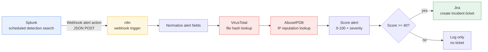

# Architecture

## Data flow

## Two equivalent implementations

This repo ships the same pipeline twice, deliberately:

1. **`n8n/soc_triage_workflow.json`** — a low-code workflow for a SOC that
   already runs n8n, where analysts can see and tweak the logic visually.
2. **`src/socpipeline/`** — a plain Python package (`pipeline.py` calls
   `virustotal.py`, `abuseipdb.py`, `scoring.py`, `jira_client.py` in the same
   order) for a SOC that would rather run this as a standalone service (e.g.
   behind a FastAPI/Flask endpoint) or invoke it from `cli.py` for one-off
   investigation of a saved alert.

Both consume the same alert shape (see
[`examples/sample_splunk_alert.json`](../examples/sample_splunk_alert.json))
and apply the same scoring rule, kept in sync intentionally — see
[`scoring.py`](../src/socpipeline/scoring.py) and the **Score Alert** node in
the n8n workflow.

## Why score instead of ticket-on-any-hit

Creating a Jira ticket for every alert that merely *has* a file hash or source
IP would flood the queue — most enrichment lookups come back clean. Scoring
first and only ticketing at `MEDIUM` (40) or above keeps the SOC's queue to
alerts an analyst actually needs to look at, while still logging every alert
(including the ones that don't page anyone) for later audit.

## Extending this pipeline

- **More enrichment sources**: add a module under `src/socpipeline/` (e.g.
  `shodan.py`, `greynoise.py`) following the same `check_*(value) -> dataclass`
  shape as `virustotal.py`/`abuseipdb.py`, then fold its signal into
  `scoring.score_alert()`.
- **More detections**: add SPL searches to [`splunk/detections.spl`](../splunk/detections.spl)
  that emit the same field names (`rule_name`, `host`, `user`, `src_ip`,
  `file_hash`, `_time`) — no pipeline changes needed.
- **Different ticketing system**: swap `jira_client.py` for e.g. a
  ServiceNow or PagerDuty client with the same `create_incident_ticket(...)`
  signature, and update `pipeline.py`'s import.
