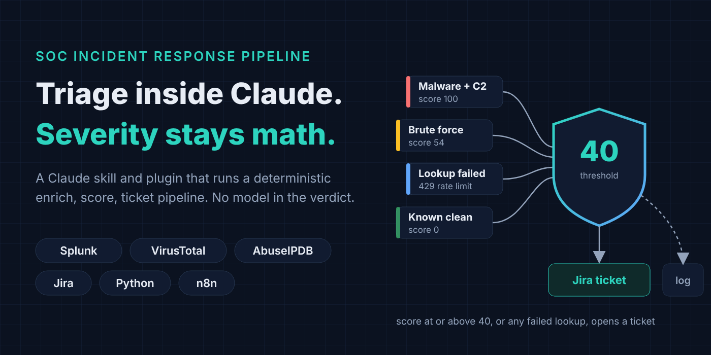
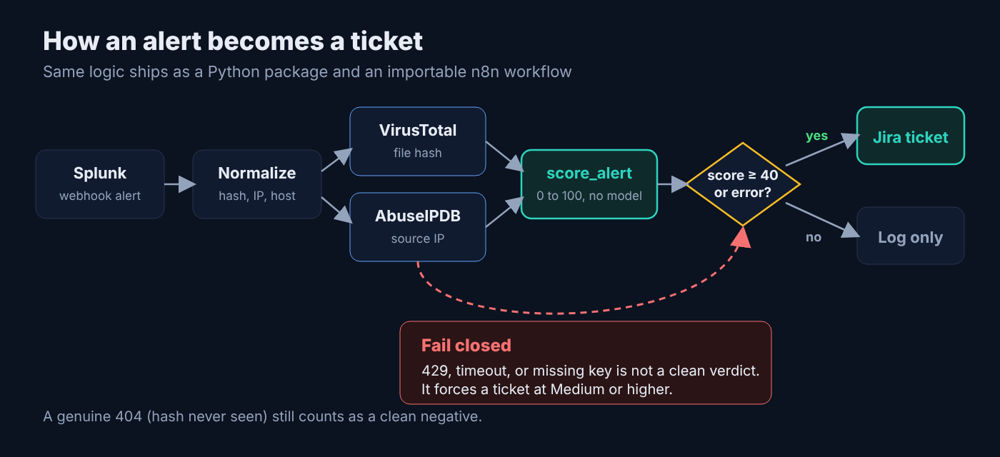
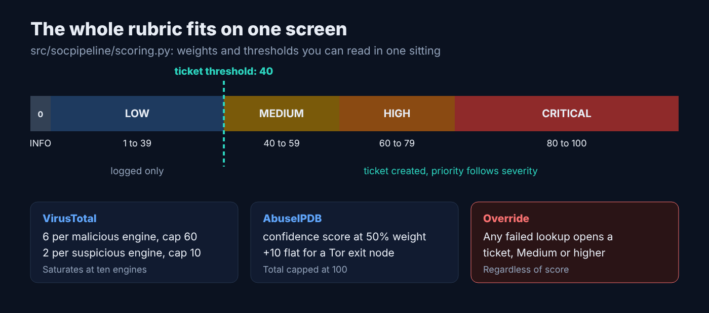
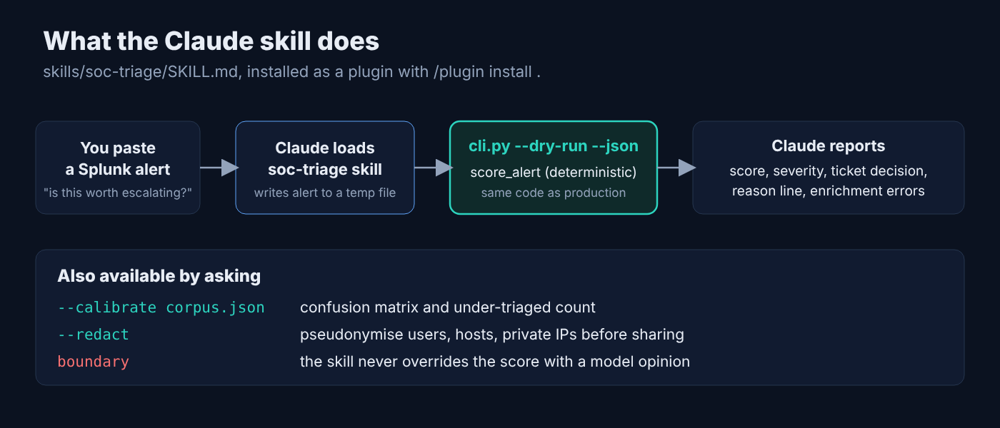
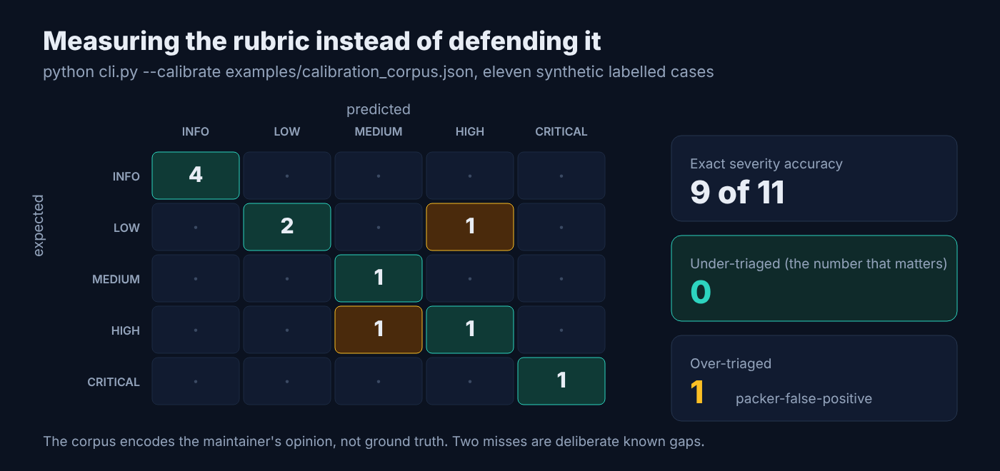

# I Put a SOC Triage Pipeline Inside Claude, and Kept the Model Out of the Verdict

*Draft for Medium. Companion metadata, image captions, distribution plan, and comment replies: [`2026-10-10-soc-incident-response-pipeline.meta.md`](2026-10-10-soc-incident-response-pipeline.meta.md). Graphics are in [`images/`](images/).*



## TL;DR

You paste a Splunk alert into Claude and ask "is this worth escalating?" Claude does not guess. It writes the alert to a file, runs [soc-incident-response-pipeline](https://github.com/Mangesh-Bhattacharya/soc-incident-response-pipeline)'s own `cli.py`, and reports the score, severity, ticket decision, and reason line the deterministic scorer returned. The model handles the conversation. Arithmetic you can read in one file handles the verdict.

The repo now ships as a Claude Code plugin with a `soc-triage` skill, on top of the Python package, the n8n workflow, and the React console it already had.

## What it is

A SOC analyst's first ten minutes on an alert are the same every time: paste the file hash into VirusTotal, paste the source address into AbuseIPDB, decide whether it is worth escalating, write the Jira ticket. This project automates that first pass and leaves the judgment call to a person.



**What ships**

- A Python package and CLI (`src/socpipeline/`, `cli.py`) with VirusTotal and AbuseIPDB clients, the scorer, and Jira ticket creation.
- An importable n8n workflow with the same logic, for a SOC already running n8n.
- A FastAPI wrapper and a React console that animates an alert through the pipeline, started with one `docker compose up --build`.
- A calibration harness (`--calibrate`) and an alert redaction tool (`--redact`).
- A Claude Code plugin manifest and the `soc-triage` skill, new this week.

The test suite has 33 tests, all with external calls mocked.

## Why it matters

Alert fatigue is a throughput problem, and the tempting fix is to suppress more. Suppression is only safe if you trust what is being dropped.

That is why severity here is not a model output. Alert payloads contain strings an attacker chose: file paths, process names, command lines, hostnames. Routing those into a model that decides whether a human ever sees the event gives an attacker a vote on their own escalation, and a successful attempt produces no alert to investigate. The same alert also has to score the same way today and at a post-incident review eight months from now, which sampling behaviour and model version drift both work against.

So the Claude skill is built around one rule: it runs the repo's scorer and reports what it returns. It does not second-guess the number. If the number looks wrong, that is a case for the calibration corpus, not a reason to talk the analyst out of it.



## Install

Prerequisites: Docker, or Python 3.10+.

**Docker, one command**

```bash
git clone https://github.com/Mangesh-Bhattacharya/soc-incident-response-pipeline.git
cd soc-incident-response-pipeline
cp .env.example .env     # add API keys, or leave blank for demo mode
docker compose up --build
```

Open `http://localhost:8080`.

**As a Claude plugin**

```bash
# from the repo root, inside Claude Code
/plugin install .
```

Any Claude product that reads `skills/soc-triage/SKILL.md` can use the skill from a clone of the repo.

**Native, no Docker**

```bash
pip install -r requirements-dev.txt
python cli.py --alert examples/sample_splunk_alert.json --dry-run
pytest tests/ -v
```

## How it works



1. You paste a Splunk alert and ask whether it is worth escalating.
2. Claude loads the `soc-triage` skill and writes the alert to a temp file.
3. It runs `python cli.py --alert <file> --dry-run --json`. Dry-run does the real enrichment and scoring and skips Jira, so the skill cannot file a ticket by accident. Creating one needs real `JIRA_*` variables and an explicit go-ahead for that run.
4. It reports score, severity, ticket decision, and the reason line, and calls out `enrichment_errors` when a lookup failed.

With no API keys set, the bundled sample returns this:

```
Score:     0/100  (INFO)
  - Enrichment incomplete, score reflects partial evidence and needs analyst review: VirusTotal: VT_API_KEY not configured; AbuseIPDB: ABUSEIPDB_API_KEY not configured
  ! Enrichment incomplete: treat the score as a lower bound, not a clean verdict
[dry-run] Would create Jira ticket: [INFO, ENRICHMENT FAILED] Suspicious Outbound Connection Following Malicious File Write — WKS-FIN-0231
```

A score of zero that opens a ticket looks odd, and it is the point. A lookup that fails (rate limit, timeout, missing key) is not the same as a lookup that returns "never seen", so the pipeline fails closed: the alert gets a ticket at Medium or higher with the failed source named. A genuine 404 still counts as a clean negative. The [previous post](2026-10-09-soc-incident-response-pipeline.md) covers that fix in detail.

### Measure the scorer instead of defending it

The skill also runs the calibration harness when you ask:

```bash
python cli.py --calibrate examples/calibration_corpus.json
```



On the bundled eleven synthetic cases, exact severity accuracy is 9 of 11, with zero under-triaged alerts (should have reached an analyst, did not) and one over-triaged (`packer-false-positive`). Under-triage is the number that matters. The corpus encodes the maintainer's opinion rather than ground truth, so replace it with your own labelled alerts before tuning any weight.

`evaluate()` in `calibration.py` accepts any scorer with `score_alert`'s signature, which is how a model-based scorer could be compared over identical inputs instead of argued about.

### Share an alert without leaking your environment

```bash
REDACT_SALT=$(openssl rand -hex 32) python cli.py --alert alert.json --json --redact
```

Users, hostnames, private IPs, and profile paths are pseudonymised with a keyed HMAC. Fields the tool does not recognise, such as command lines and URLs, are dropped because they routinely carry credentials. Public IPs and hashes are kept, since they are the indicators. Read the output before you post it: this reduces exposure and does not certify an alert as safe.

## Known limitations

- The VirusTotal term saturates at ten engines, so ten and seventy detections score the same 60 points.
- Scoring uses absolute detection counts, not ratios.
- There is no behavioural axis. Event count is discarded at normalisation, which is why a brute-force burst from a Tor address lands at MEDIUM (54) rather than HIGH. The calibration corpus records it as a known miss.
- No enrichment caching, backoff, or retry. Fail-closed means a quota burst now floods the queue instead of silently dropping evidence, which is the safer failure and still a failure.
- Enrichment sends hashes and addresses to VirusTotal and AbuseIPDB. Air-gapped deployments need a different client.
- The n8n webhook accepts unauthenticated POSTs by default. Restrict it before exposing it beyond a lab.
- The skill runs on demand when you invoke it. It is a triage assistant, not a streaming consumer of your Splunk feed; the Splunk webhook into n8n or the API is the always-on path.

## Contribute

Issues and pull requests are welcome, and corrections are as welcome as features. In rough order of value:

1. A real, anonymised, labelled alert corpus to replace the synthetic one.
2. Enrichment caching with backoff.
3. Ratio-based VirusTotal scoring and a behavioural axis.
4. Surfacing `enrichment_failed` in the dashboard.
5. A ServiceNow or TheHive ticketing backend. `jira_client.py` is small and isolated.

If you run this on real alert volume, the most useful thing you can send is an alert that scored LOW and should have been CRITICAL, redacted first, with the enrichment values that produced it.

Repo: https://github.com/Mangesh-Bhattacharya/soc-incident-response-pipeline

---

*Written by Mangesh Bhattacharya. If you work in detection engineering or SOC automation and think the scoring gate belongs somewhere else, I want to hear the argument.*
